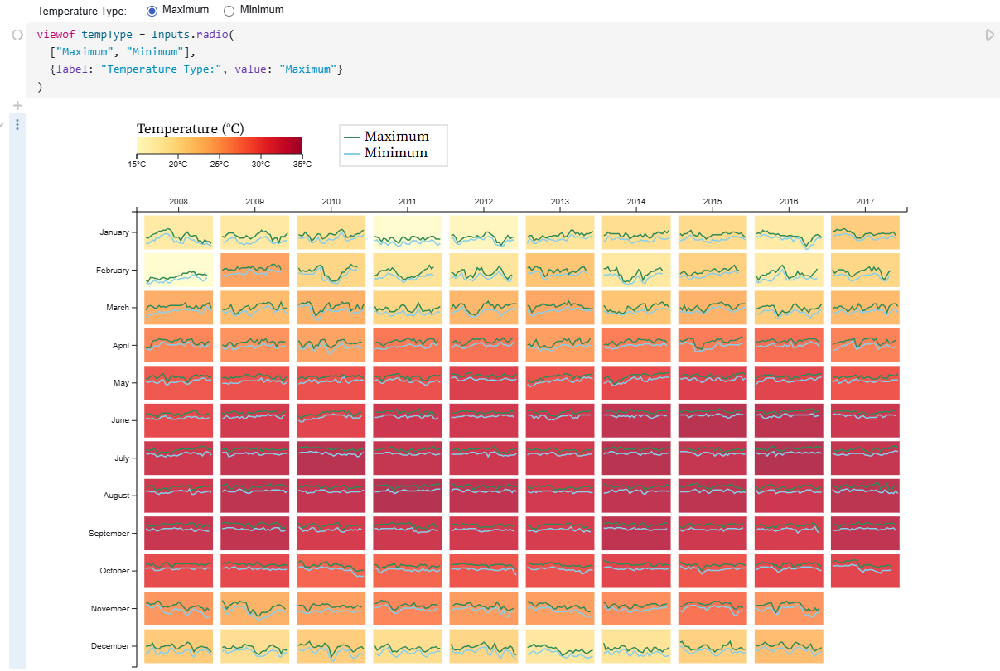
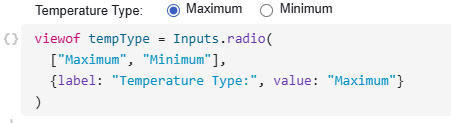
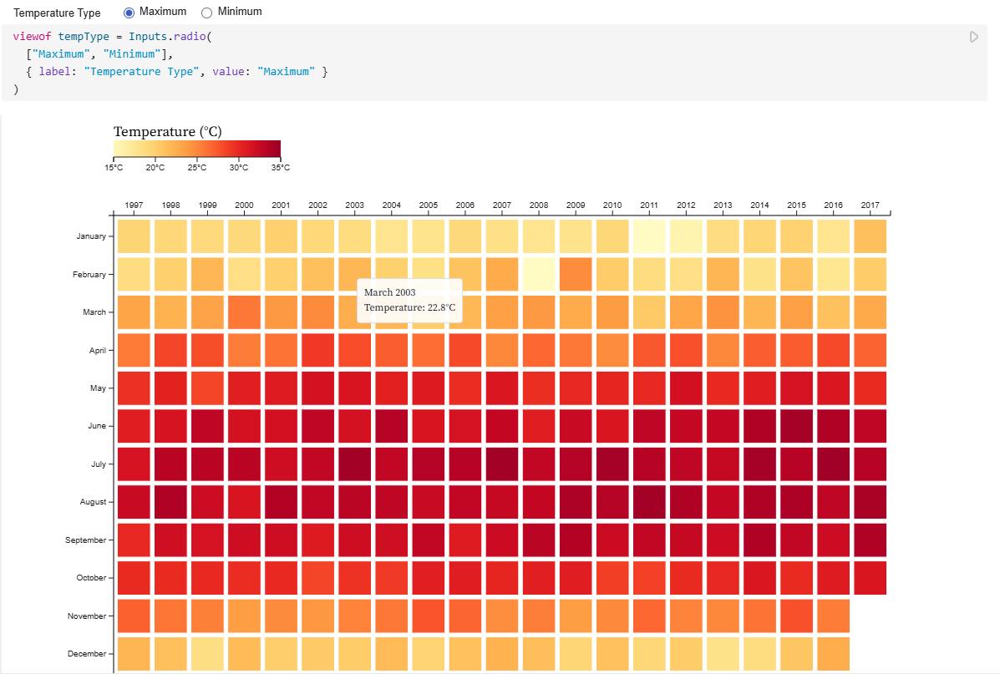

# Coding Exercise for D3.js: Temperature Heatmap

## Level 1: Monthly Temperature Heatmap
[Link to Observable Notebook: https://observablehq.com/@mihir-sunil-godbole/temp_viz ]

A basic heatmap visualization showing monthly temperature patterns across years.

### Features
- Monthly average temperatures displayed in a year-month matrix
- Interactive toggle between maximum and minimum temperatures
- Tooltip showing detailed temperature information
- Color legend indicating temperature scale

### Screenshots
Heatmap:

Max-min toggle:

## Level 2: Enhanced Temperature Heatmap
[Link to Observable Notebook: https://observablehq.com/@mihir-sunil-godbole/temp_viz_2]

An advanced version incorporating daily temperature variations within each month.

### Features
- All features from Level 1
- Daily temperature variations shown as line charts within each cell
- Dark green line for maximum temperatures
- Sky blue line for minimum temperatures
- Focus on the last 10 years of data

### Screenshots

